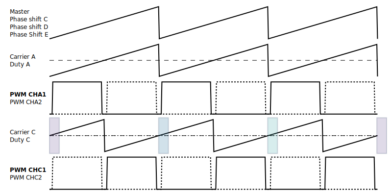
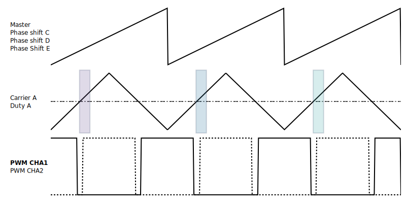
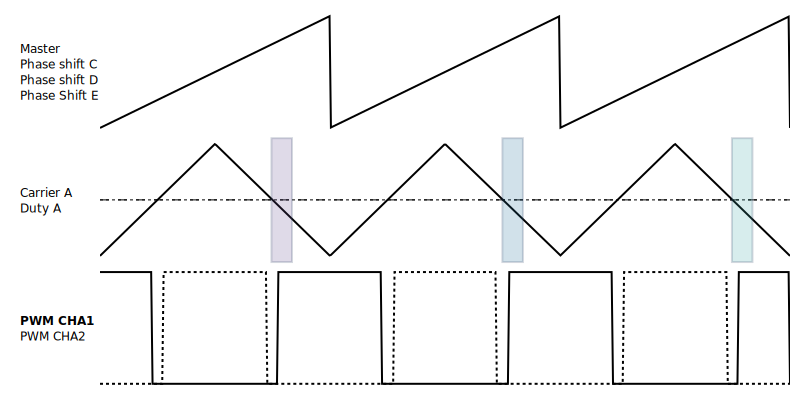
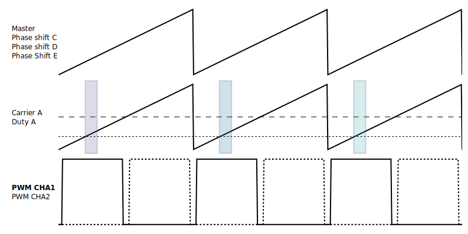
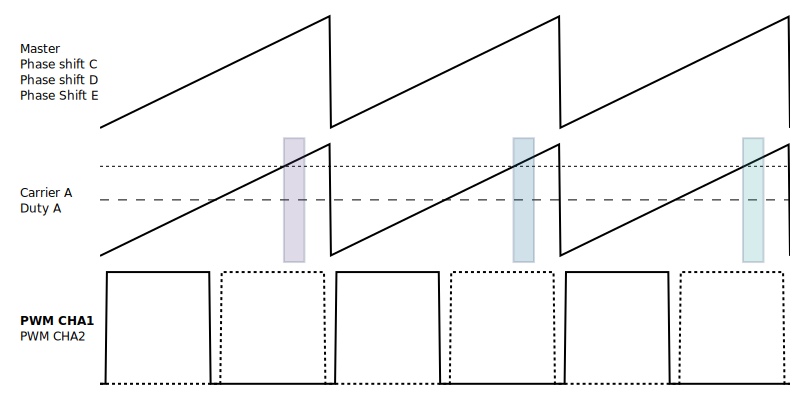
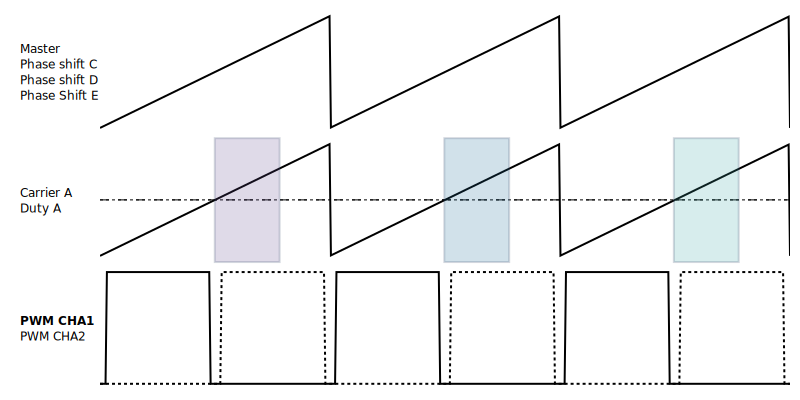
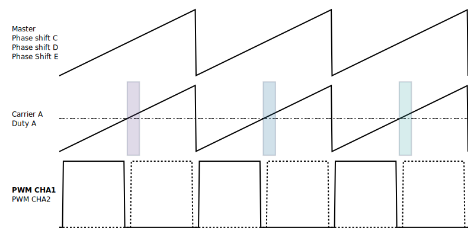
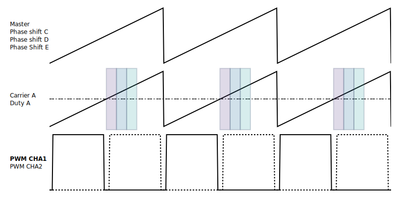
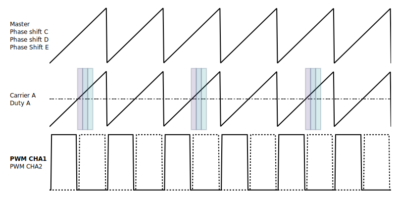
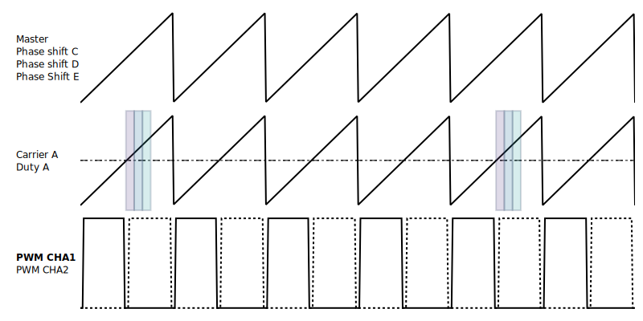

## Software triggered


## Synchronous with PWMs

!!! note
    These features are available for ADC1 and ADC2.

### Linking ADC and PWM channel

ADC1 and ADC2 can be associated with PWM channels at will. 

=== "ADC1 and PWMA"
    { width=800 }

    ```c++
        spin.pwm.startSingleOutput(PWMA, TIMING_OUTPUT1);    
    ```

    ::: doxy.powerAPI.class.method
    name: AdcHAL
    method: void AdcHAL::configureDiscontinuousMode ()

=== "ADC1 and PWMC"
    { width=800 }

    ```c++
        spin.pwm.startSingleOutput(PWMA, TIMING_OUTPUT2);    
    ```

### Modulation impact

!!! note 
    Hardware trigger depends on PWM modulation.

=== "Left Aligned Modulation"
    { width=800 }

    ```c++
        spin.pwm.startSingleOutput(PWMA, TIMING_OUTPUT1);    
    ```

=== "Center aligned modulation"
    { width=800 }

    ```c++
        spin.pwm.startSingleOutput(PWMA, TIMING_OUTPUT2);
    ```

### Rising Edge / Falling edge

!!! note 
    This only applies to center aligned modulation.

=== "Rising Edge"
    { width=800 }

    ```c++
        spin.pwm.startSingleOutput(PWMA, TIMING_OUTPUT1);    
    ```

=== "Falling Edge"
    { width=800 }


    ```c++
        spin.pwm.startSingleOutput(PWMA, TIMING_OUTPUT2);    
    ```


### Measurment trigger instant

!!! note 
    This feature is only available in left aligned modulation.

=== "20% Duty cycle"
    { width=800 }

    ```c++
        spin.pwm.setDutyCycle(PWMA, 0.2);

    ```


=== "80% Duty cycle"
    { width=800 }

    ```c++
        spin.pwm.setDutyCycle(PWMA, 0.8);
    ```

### Sampling time

Sampling times can be selected in order to take longer time measurement. It is similar to the exposure time taken for a photograph. The longest is the sampling time, the more averaged the signal will be.

!!! note 
    Default value is 446ns.

=== "Sampling time 1.410us"
    { width=800 }

    ```c++
        spin.pwm.startSingleOutput(PWMA, TIMING_OUTPUT2);    
    ```

=== "Sampling time 446ns"
    { width=800 }
    

    ```c++
        spin.pwm.startSingleOutput(PWMA, TIMING_OUTPUT1);    
    ```


### Continuous / Discontinuous sequence

!!! note 
    This is relevant if more than one measurement is taken with the same ADC.

=== "Continuous sequence"
    { width=800 }

    ```c++
        spin.pwm.startSingleOutput(PWMA, TIMING_OUTPUT2);    
    ```

=== "Discontinuous sequence "
    { width=800 }

    ```c++
        spin.pwm.startSingleOutput(PWMA, TIMING_OUTPUT1);    
    ```


### Number of PWM period between acquisition

!!! note 
    This is relevant if more than one measurement is taken with the same ADC.

=== "With 2 periods"
    { width=800 }

    ```c++
        spin.pwm.startSingleOutput(PWMA, TIMING_OUTPUT1);    
    ```

=== "With 4 periods"
    { width=800 }

    ```c++
        spin.pwm.startSingleOutput(PWMA, TIMING_OUTPUT1);    
    ```

=== "Without interuptions"
    { width=800 }

    ```c++
        spin.pwm.startSingleOutput(PWMA, TIMING_OUTPUT2);    
    ```


## API Reference 

::: doxy.powerAPI.class
name: AdcHAL


