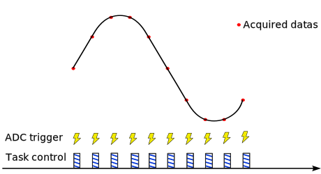

An ADC, or Analog-to-Digital Converter, is a device that turns analog signals, like sound or temperature, into digital data that a computer or microcontroller can understand. It measures the analog voltage and converts it into a digital value that can be used by digital systems for processing, storage, or display.

## Software triggered

=== " "
    { align=left }

    A software trigger for an ADC is a command or signal generated by the software to start the ADC conversion process. Instead of using a hardware signal or event to initiate the conversion, the ADC is triggered by software instructions, allowing for precise control and synchronization with other software processes or events. For example this trigger command can be generated from a high speed control task.

    ```C++
    spin.adc.configureTriggerSource(2, software); // ADC 2 configured in software mode
    data.triggerAcquisition(2); // Send an adc trigger to ADC2 to start conversion
    adc_value = data.getLatest(2, 35); // Get the acquired data
    ```

    !!! example 
        see the following example for an application :  

        - [Software trigerred ADC](https://owntech-foundation.github.io/Documentation/examples/SPIN/ADC/adc_software_trigger/) 

## Synchronous with PWMs

!!! note
    These features are available for ADC1 and ADC2.

### Linking ADC and PWM channel

ADC1 and ADC2 can be associated with PWM channels at will. 

::: doxy.powerAPI.class.method
name: AdcHAL
method: void configureDiscontinuousMode (uint8_t adc_number, uint32_t dicontinuous_count) 

=== "ADC1 and PWMA"
    { width=800 }

    ```c++
        spin.pwm.setAdcTrigger(PWMA, ADCTRIG_1);    
        spin.pwm.enableAdcTrigger(PWMA);
    ```
    
=== "ADC1 and PWMC"
    { width=800 }

    ```c++
        spin.pwm.setAdcTrigger(PWMC, ADCTRIG_1);    
        spin.pwm.enableAdcTrigger(PWMC);
    ```

### Modulation impact

!!! note 
    Hardware trigger depends on PWM modulation.

=== "Left Aligned Modulation"
    { width=800 }

    ```c++
        spin.pwm.setAdcTrigger(PWMA, ADCTRIG_1);    
        spin.pwm.enableAdcTrigger(PWMA);
    ```

=== "Center aligned modulation"
    { width=800 }

    ```c++
        spin.pwm.setAdcTrigger(PWMA, ADCTRIG_1);    
        spin.pwm.enableAdcTrigger(PWMA);
    ```

### Rising Edge / Falling edge

!!! note 
    This only applies to center aligned modulation.

=== "Rising Edge"
    { width=800 }

    ```c++
        spin.pwm.setAdcEdgeTrigger(PWMA, EdgeTrigger_up);
        spin.pwm.setAdcTrigger(PWMA, ADCTRIG_1);    
        spin.pwm.enableAdcTrigger(PWMA);
    ```

=== "Falling Edge"
    { width=800 }


    ```c++
        spin.pwm.setAdcEdgeTrigger(PWMA, EdgeTrigger_down);
        spin.pwm.setAdcTrigger(PWMA, ADCTRIG_1);    
        spin.pwm.enableAdcTrigger(PWMA);
    ```


### Measurment trigger instant

!!! note 
    This feature is only available in left aligned modulation.

=== "20% Duty cycle"
    { width=800 }

    ```c++
        spin.pwm.setAdcTriggerInstant(PWMA, 0.2);

    ```

=== "80% Duty cycle"
    { width=800 }

    ```c++
        spin.pwm.setAdcTriggerInstant(PWMA, 0.8);
    ```

### Continuous / Discontinuous sequence

!!! note 
    This is relevant if more than one measurement is taken with the same ADC.

=== "Continuous sequence"
    { width=800 }

    ```c++
        spin.adc.configureDiscontinuousMode(1, 0);    
    ```

=== "Discontinuous sequence "
    { width=800 }

    ```c++
        spin.adc.configureDiscontinuousMode(1, 1);    
    ```


### Number of PWM period between acquisition

!!! note 
    This is relevant if more than one measurement is taken with the same ADC.

=== "With 2 periods"
    { width=800 }

    ```c++
        spin.pwm.setAdcTriggerPostScaler(PWMA, 2);    
    ```

=== "With 4 periods"
    { width=800 }

    ```c++
        spin.pwm.setAdcTriggerPostScaler(PWMA, 4);    
    ```

=== "Without interuptions"
    { width=800 }

    ```c++
        spin.pwm.setAdcTriggerPostScaler(PWMA, 1);    
    ```
!!! example
    see the following example for an application :  

    - [PWM trigerred ADC](https://owntech-foundation.github.io/Documentation/examples/SPIN/ADC/adc_hrtim_trigger/) 

## API Reference 

::: doxy.powerAPI.class
name: AdcHAL


