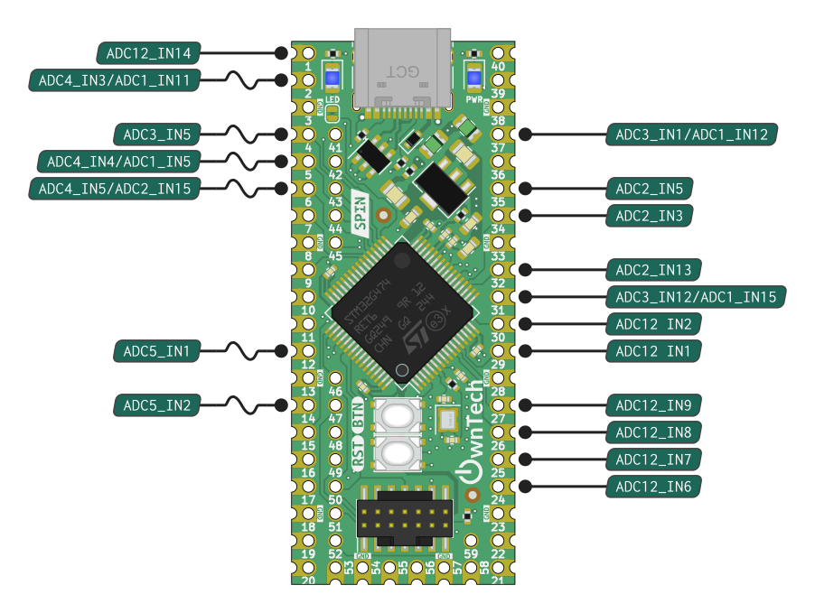
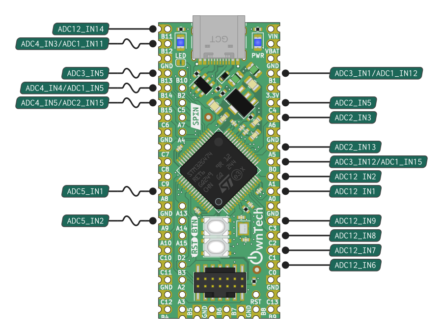
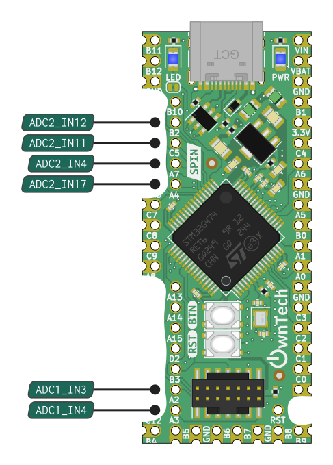

!!! note ""
    Data acquisition is the process of sampling signals that measure real-world physical conditions and converting the resulting samples into digital numeric values that can be manipulated by a computer.

    In the PowerAPI context, the DataAPI helps the user to easily configure the ADC and retrieve the acquired values.

    The Data API configures the DMAs to store the ADCs acquisitions for the Spin board, and dispatches them in per-channel buffers that can be read by the user. The module also provides functions to convert the raw values acquired by the sensors into values in the adequate unit.

    If using a shield such as Twist, a dedicated interface for sensors configuration is made available by the [Shield sensors API](twistAPI.md).

## Quick start with Spin Data API

### Include

Data API is part of Spin API: it is made available by including the `SpinAPI.h` header. From there, a `spin.data` object is available to interact with the API.
!!! note
    ```
    #include <SpinAPI.h>
    ```

### Setup phase

To use Data API, the first stage is to indicate on which pin of the Spin board you want to acquire data. Not all pins can be used for that purpose: the pin must be linked to an ADC. Here is the list of pins that provide ADC capabilities:

=== "SPIN v1.1.0"
    { width=451 align=left }
    { width=243 }

=== "SPIN v1.0.0"
    { width=451 align=left }
    { width=243 }

To indicate that the value of a pin should be acquired, the acquisition must be enabled on this pin in the setup phase. This can be done using the `enableAcquisition()` function:

!!! note
    ```
    // Pins connected to a single ADC:
    spin.data.enableAcquisition(35); // Enable acquisition on pin 35 (will use ADC 2)
    spin.data.enableAcquisition(12); // Enable acquisition on pin 12 (will use ADC 5)
    // Pins connected to multiple ADCs:
    spin.data.enableAcquisition(5, ADC_4); // Acquisition on pin 5 using ADC 4
    spin.data.enableAcquisition(31); // Acquisition on pin 31 (will use ADC 1 by default)
    ```

Note that providing the ADC number is not required. For pins connected to multiples ADC, the ADC with the lowest number will be used if no ADC is specified. Specifying an ADC number that is not available on the pin will result in an error.

By default, the acquisitions are software-triggered, which means that when your program will want to acquire a measure, you'll have to trigger the acquisition. Other means of triggering the measure exists, notably periodic acquisitions, see [detailed information](adc.md#synchronous-with-pwms). If you need to change the trigger source, this must be done at this point.

At the end of all the hardware configuration (including other modules), the Data API must be started using the `start()` function. Note that in case you use an [uninterruptible task](scheduling.md), you do not need to start the Data API manually, this will be done automatically when the uninterruptible task is started.

### Obtaining data

After the Data API has been started, it becomes possible to get data obtained from the enabled pins. Depending on the trigger source, you'll have to trigger the acquisition then read the value, or directly read the value.

If software-trigged is used for an ADC (default configuration), the acquisition must first be triggered, then the value read. If the acquisition is configured to be periodic for ann ADC, directly read the value.

=== "Sofware-triggered acquisition"
    ```
    spin.data.triggerAcquisition(ADC_2); // Trigger acquisitions of all pins linked to ADC 2
    spin.data.getLatestValue(35); // Get value read on pin 35
    ```

=== "Periodic acquisition"
    ```
    spin.data.getLatestValue(35); // Get value read on pin 35
    ```

## Data dispatching

When using the control task (critical task) data are dispatched at the start, which means there are ready to be retrieved.


## Initialization sequence

If you want specific ADC behavior (trigger sources, discontinuous mode, etc.), you may want to configure the ADCs using the lower-level [ADC API](adc.md) first. Then, you can enable channels that you want to acquire.

After channels have been enabled, the conversion parameters can be set so that raw values can be automatically converted to the relevant unit. This is done using the `data.setParameters()` function.

After channels have been enabled (and optionnally conversion parameters have been set), there are two ways of starting the API, depending on your use of other OwnTech APIs. If your code uses an [uninterruptible task](scheduling.md), nothing more is required, the Data API will be started automatically when task is started. However, if you do not have an uninterruptible task in your code, you need to manually start the API by calling `data.start()`.

!!! Note

    === "Software triggered"
        1.  Enable acquisition on the pins you want: [`data.enableAcquisition()`](https://owntech-foundation.github.io/Documentation/core/docs/dataAPI/#function-enableacquisition)
        2.  Define acquisition conversion parameter: [`data.setParameters()`](https://owntech-foundation.github.io/Documentation/core/docs/dataAPI/#function-setparameters-22)
        3.  start data dispatching [`data.start()`](https://owntech-foundation.github.io/Documentation/core/docs/dataAPI/#function-start)
        4. Trigger an initial adc conversion [`data.triggerAcquisition(ADCx)`](https://owntech-foundation.github.io/Documentation/powerAPI/classAdcHAL/#function-enablechannel)
        5.  Retrieve values : [`data.getLatest()`](https://owntech-foundation.github.io/Documentation/core/docs/dataAPI/#function-getlatest-12) or [`data.getRawValues()`](https://owntech-foundation.github.io/Documentation/core/docs/dataAPI/#function-getrawvalues-12)

    === "Hardware triggered"
        1.  [Make sure PWM engine is initialized](https://owntech-foundation.github.io/Documentation/core/docs/pwm/)
        2.  Enable acquisition on the pins you want: [`data.enableAcquisition()`](https://owntech-foundation.github.io/Documentation/core/docs/dataAPI/#function-enableacquisition)
        3.  Define acquisition conversion parameter: [`data.setParameters()`](https://owntech-foundation.github.io/Documentation/core/docs/dataAPI/#function-setparameters-22)
        4.  start data dispatching [`data.start()`](https://owntech-foundation.github.io/Documentation/core/docs/dataAPI/#function-start)
        5.  Retrieve values : [`data.getLatest()`](https://owntech-foundation.github.io/Documentation/core/docs/dataAPI/#function-getlatest-12) or [`data.getRawValues()`](https://owntech-foundation.github.io/Documentation/core/docs/dataAPI/#function-getrawvalues-12)

!!! example

    === "Software triggered ADC"
        ```cpp
        data.enableAcquisition(1, 5); // ADC 1 ; Pin 5
        data.triggerAcquisition(1); // ADC 1
        float32_t adc_value = data.getLatest(1, 5); // ADC 1 ; Pin 5
        ```
    === "Hardware triggered ADC"
        ```cpp
        /* PWM unit initialization */
        spin.pwm.setModulation(PWMA, UpDwn);
        spin.pwm.setAdcEdgeTrigger(PWMA, EdgeTrigger_up);
        spin.pwm.setAdcDecimation(PWMA, 1);
        spin.pwm.setMode(PWMA, VOLTAGE_MODE);
        spin.pwm.initUnit(PWMA);
        spin.pwm.setDeadTime(PWMA, 200,200);
        spin.pwm.setAdcTrigger(PWMA, ADCTRIG_1);
        spin.pwm.enableAdcTrigger(PWMA);
        spin.pwm.setDutyCycle(0.5);
        spin.pwm.startDualOutput(PWMA);

        /* ADC initialization */
        spin.adc.configureTriggerSource(1, hrtim_eev1); // ADC 1 ; HRTIM event 1
        spin.adc.configureDiscontinuousMode(1, 1); // ADC 1 ; acquire 1 pin at each event
        data.enableAcquisition(1, 5); // ADC 1 ; Pin 5
        data.start();
        float32_t adc_value = data.getLatest(1, 5); // ADC 1 ; Pin 5
        ```

## Retrieving last value

Getting the last measured value to feed the control algorithm is super simple.

!!! example
    === "Get last value"
        ```
        data.getLatest(1, 5)
        ```
        This will retrieve the last sampled value of ADC 1 pin 5.

## Getting values with the right unit

DataAPI contains commodity functions to convert the raw binary measurement values in meaningful units.

!!! example
    === "Converting in volts"
        ```
        data.setParameters()
        ```

## Get an array of values

DataAPI contains commodity function to retrieve an array of raw values that can be fed to a [post processing filter](controlLibrary/controlLibrary/docs/use-filters).

!!! example
    === "Retrieve 5 values"
        ```
        data.getRawValues()
        ```

::: doxy.powerAPI.class
name: DataAPI

## Using the Data API with a Twist shield

The Data API is optimized for running on Twist shields.
It provides variants of the functions that take Twist sensors as parameters instead of pins numbers.

To enable the Twist Shield channels, use `set(SHIELD twist)` in `CMakeLists.txt`. From there, this module will provide additional functions to acquire and convert Twist channels by name.

If you use the Twist sensors, you can use `data.enableTwistDefaultChannels()` to automatically perform a standard configuration. From there, all current/tension channels of the Twist shields will be enabled as part of the default configuration. Default parameters for the channels are also loaded automatically as part of the process.
