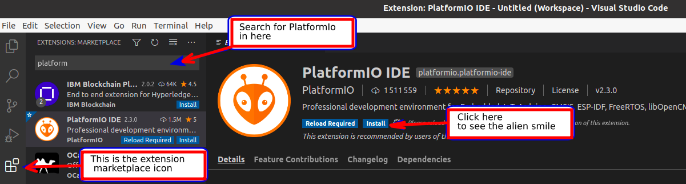

If you use or wish to use Visual Studio Code, follow this tutorial to set up your work environment. It will use a “Blinky” (blinking LED) example which requires no other hardware than you OwnTech board.


## Requirements

Before we start, make sure your machine meets all the requirements below.

!!! tips "Required software"
    === "Windows"
        - **Git:** If you do not have git installed, get it here [git for Windows](https://gitforwindows.org)
        - **Python3:** If you do not have python3 installed, get it here [Python3 Installers](https://www.python.org/downloads/windows)
        - **CMake:** If you do not have CMake installed, get it here [CMake Installer](https://cmake.org/download/)
        - **Internet connection**

    === "macOS"

        - **Git:** If you do not have git installed, get it here [git for macOS](https://git-scm.com/download/mac)
        - **Python3:** If you do not have python3 installed, get it here [Python3 Installers](https://www.python.org/downloads/macos/)
        - **CMake:** If you do not have CMake installed, get it here [CMake Installer](https://cmake.org/download/)
        - **Internet connection**

    === "Linux"

        - **Git:** If you do not have git installed, get it here [git for Linux](https://git-scm.com/download/linux)
        - **Python3:** If you do not have python3 installed, get it here [Python3 Installers](https://docs.python-guide.org/starting/install3/linux/)
            - The [pip](https://pip.pypa.io/en/stable/) package installer is needed. If using the system Python (`/usr/bin/python3`), `pip` may not be installed by default.
              See [Installing pip with Linux Package Managers](https://packaging.python.org/en/latest/guides/installing-using-linux-tools/).
            - The [venv](https://docs.python.org/3/library/venv.html) module is needed.
              Warning if using the system Python: although `venv` is part of the Python Standard Library, some Linux distributions such as Debian and Ubuntu don't install it by default.
              In that case, make sure that the `python3-venv` package is installed.
        - **CMake:** If you do not have CMake installed, get it here [CMake Installer](https://cmake.org/download/)
        - 64 bit linux installation
        - Write permission for the serial port (`/dev/ttyACM0`): See PlatformIO documentation which provides a [udev rules file](https://docs.platformio.org/en/latest/core/installation/udev-rules.html)
        - **Internet connection**


## Setup your work environment

To use OwnTech's system, we will use:

* **Visual Studio Code** - The platform or Integrated Development Environment we will use to write code.
* **PlatformIO** - A Visual Studio Code plugin that is a toolbox for microcontrollers

!!! info "Required Disk Space"
    Make sure that you have more than 2GB on your hard drive so that PlatformIO can download all the required files without issues.

Here is how to setup the work environment:

### Step 1 - Empty folder

Create an empty folder in which you will work throughout the tutorials.

!!! warning
    === "Windows"
        - Make sure that you have **administrator privileges** on the folder where you clone your repository.
        - Check that you are working on a **path that is not linked to OneDrive**
        - Check that you **do not have any spaces in the path** of your project
        - Check that the **length of your project** path is smaller than 256 characters.
        - You should preferably have your project folder as close as possible to the root


### Step 2 - Install Visual Studio Code

[Download ](https://code.visualstudio.com/#alt-downloads) and install Visual Studio Code (“VS Code” for short).

An overview of VS Code user interface is available in their official [Get Started / User Interface](https://code.visualstudio.com/docs/getstarted/userinterface) documentation.


### Step 3 - Install PlatformIO

Launch Visual Studio Code.

In the “Activity Bar”, located on the far left-hand side, click on the Extensions icon (1)
{ .annotate } to open the VS Code Extensions manager in the Primary Side Bar.

1. The icon looks like this: 

Using the search box in the Extensions Marketplace, search for the “PlatformIO IDE” extension and install it.

Finally, restart Visual Studio Code when you are prompted to do so.



Once installed, you should see that PlatformIO has appended its “alien head” icon (1)
{ .annotate } to the Activity Bar.

1. The PlatformIO icon looks like this: 

!!! tip   "Pro tip"
    If the alien icon does not show up spontaneously, wait for a few more seconds, then press F1 key and type "platformio home".


### Step 4 - Open PlatformIO in VS Code

In VS Code Activity Bar, click on the newly added PlatformIO “alien head” icon
to open PlatformIO in the Primary Side Bar. It should contain:

- “Project Tasks” view, at the top (without any task list at that stage, since you haven’t opened a PlatformIO project at this stage)
- “Quick Access” view, below


### Step 5 - Clone our Core repository

In PlatformIO's “Quick Access” view, select the “Miscelleanous / Clone Git Project” action.
This will open a field in which you should enter the following Git reposity address:

```
https://github.com/owntech-foundation/Core
```

PlatformIO will then ask you in which folder the project should be cloned.
Choose the folder you have created previously.
This will start the cloning process (with a progress window popping up in the lower right corner).

At the end of the cloning process, VS Code will ask you if you wish to open the cloned repository
and you should answer yes ("Open" or "Open in New Window").

Once the project folder is opened, a popup will appear asking if you trust the authors of the files in this folder.
You can trust us. :smile:


Once the repository is cloned successfully,
make sure you are on the `main` branch of the Git project.
The name of the current branch is displayed on the left side of the Status Bar, at the bottom of the VS Code window,
as highlighted in the following screenshot:


Now the project is successfully opened and you should see two tabs in the Editor area:

- the “PIO Home” tab thay we will not use here
  (remark: PIO Home’s Devices tab can be used to check that your board is well detected once connected)
- the `platformio.ini` [Project Configuration File](https://docs.platformio.org/en/latest/projectconf/index.html),
  which is already well configured for the present example

This first example you have just opened implements a simple “Blinky” (blinking LED) demo.
If you wish to understand how it is implemented, open and read through the main C++ code which is `main.cpp`,
located in the `src` folder. VS Code file Explorer can be opened from the first icon at the top of the Activity Bar.


### Step 6 - Build our Core code

In the Status Bar, at the bottom of the VS Code window, click on the Build (`✓`) icon. This will launch the code compilation process.


!!! tip "Coffee Time"
    During your first build, PlatformIO will download all the necessary dependencies of our code. This may take several minutes depending on your machine and your internet connection.

    Do not hesitate to go get yourself a coffee.

When the compilation is completed, you should see:


!!! note
    If you encounter an error during compilation, please refer to the troubleshooting section below.


### Step 7 - Prepare your hardware

Before running the code, make sure that you meet the following requirements:

!!! note "Requirements for running the code on a board"
     - Have your [VS Code Environment](#setup-your-work-environment) already set up
     - Run your first compilation [successfully](#step-6---build-our-core-code).
     - Have an USB-C cable ready
     - Have a SPIN board ready (stand-alone or embedded on a TWIST)

=== " "
    {align=left}

    - Connect the SPIN board to your computer via the USB.
    - Notice that the LED PWR must turn on.
    - Here you see the connection of a SPIN board embedded onto a TWIST board.


### Step 8 - Upload our Core code in your SPIN board

Now it is time to run a Blinky (i.e. blinking LED) example on the board.

This requires uploading (or flashing) the compiled code to the SPIN controller board.
To do so, press the Upload icon (`→`, just to the right of the Build icon `✓`).

!!! tip   "Pro tip"
    The Build and Upload action buttons are also available in the top right corner of the Editor area

!!! tip "Coffee time 2"
    During your first upload, PlatformIO will automatically download the necessary depencies to send data to the SPIN board. Depending on your machine and your internet connection, this might take some time.

    Time to pour another coffee.

??? bug "Known bug - mcumgr"

    === "macOS"
         The upload requires a software called **mcumgr**.

         As of the time of writing, we have experienced issues with some macOS devices in finding it.

         Please refer to the [ongoing issue](https://github.com/owntech-foundation/Core/issues/5) to handle it if you have the error below.

         

If everything goes well, you will get a success as in the image below.


Finally, allowing a few extra seconds for the board to reboot, you will see the `LED` LED blink.

!!! success " :party_popper: Success"
     Congratulations! You have uploaded your first code!

If you want to make sure you really master this first example, you can change the blinking frequency.
The blinking period is set at the last line of the `loop_background_task()` routine in the `main.cpp` file
(`1000` by default, expressed in ms).
After saving the modified code, you will need to redo the Build and Upload steps.


## Troubleshooting

From our exeprience, there are multiple types of errors that can block your compilation.

Check the list below of possible issues

??? bug "Troubleshooting"

    === "Windows"
        - **Git:** If you do not have git installed, get it here [git for Windows](https://gitforwindows.org)
        - **Python3:** If you do not have python3 installed, get it here [Python3 Installers](https://www.python.org/downloads/windows)
        - **CMake:** If you do not have CMake installed, get it here [CMake Installer](https://cmake.org/download/)
        - Make sure that you have **administrator privileges** on the folder where you clone your repository.
        - Check that you are working on a **path that is not liked to OneDrive**
        - Check that you **do not have any spaces in the path** of your project
        - Check that the **length of your project** path is smaller than 256 characters.
        - You should preferably have your project folder as close as possible to the root
        - Be sure the SPIN board PWR LED lights up correctly when connected to the USB
        - Check your USB-C cable is working and can handle data
        - Check your internet connectin is up and running

    === "macOS"
        - **Git:** If you do not have git installed, get it here [git for macOS](https://git-scm.com/download/mac)
        - **Python3:** If you do not have python3 installed, get it here [Python3 Installers](https://www.python.org/downloads/macos/)
        - **CMake:** If you do not have CMake installed, get it here [CMake Installer](https://cmake.org/download/)
        - Be sure the SPIN board PWR LED lights up correctly when connected to the USB
        - Check your USB-C cable is working and can handle data
        - Check your internet connectin is up and running
        - If you have a problem with `mcumgr`, please refer to the [ongoing issue](https://github.com/owntech-foundation/Core/issues/5) to handle it.


    === "Linux"

         - **Git:** If you do not have git installed, get it here [git for Linux](https://git-scm.com/download/linux)
        - **Python3:** If you do not have python3 installed, get it here [Python3 Installers](https://docs.python-guide.org/starting/install3/linux/)
        - **CMake:** If you do not have CMake installed, get it here [CMake Installer](https://cmake.org/download/)
        - Check that your Linux is 64bits
        - Be sure the SPIN board PWR LED lights up correctly when connected to the USB
        - Check your USB-C cable is working and can handle data
        - Check your internet connectin is up and running


??? success "List of contributors"
    Here is a short list of contributors to this page:

    - 2024.07.11: Pierre Haessig
    - 2024.02.24: Ayoub Farah, Luiz Villa
    - 2021.11.04: Loïc Quéval, Romain Delpoux, Adrien Prévost
    - 2021.11.07: Luiz Villa, Antoine Boche
    - 2022.01.24: Luiz Villa, Adrien Prevost, Loïc Quéval
    - 2022.03.13: Luiz Villa
    - 2022.05.06: Luiz Villa
    - 2022.06.23: Loïc Quéval
    - 2022.01.16: Mathilde Longuet and Luiz Villa
    - 2023.07.10: Luiz Villa
    - 2023.09.02: Mathilde Longuet
    - 2023.09.25: Mathilde Longuet
