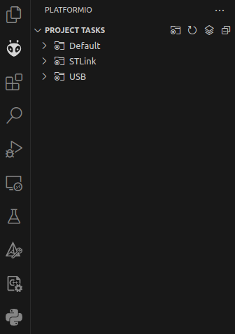
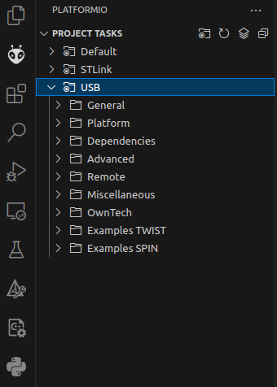
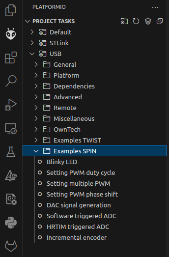
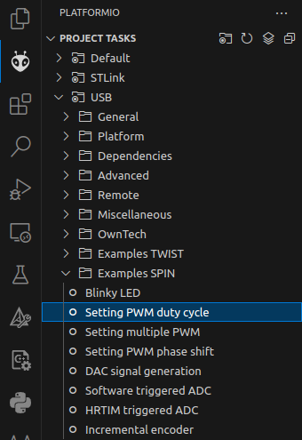
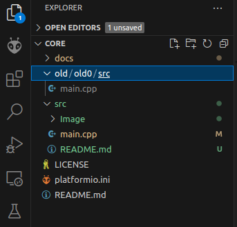
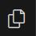
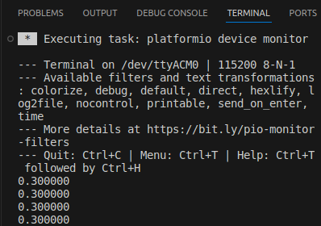

The best way "to owntech" is to use our examples.

In this section we will show you how to use our example interface.

## Requirements

Before you start, please make sure you fullfil the requirements below.

!!! note "Requirements"
     - Have your [VSCode Environment](environment_setup.md#setup-your-work-environment) already setup
     - Run your first compilation [successfully](environment_setup.md#step-6-build-our-core-code).
     - Run your first upload [successfully](environment_setup.md#step-8-upload-our-core-code-in-your-spin-board).
     - Have an USB-C cable ready
     - Have a SPIN board ready (stand-alone or embedded on a TWIST)
     - Have an internet connection up and running

## Using the example interface

We have developed an automatic method to use the examples available in our [github example repository](https://github.com/owntech-foundation/examples) within our environment.

Here are the steps to use it.

### Step 1 - Open project tasks

=== " "
    {align=left}

    Click on the PlatformIO alien icon. (1)
    {.annotate}

    1. The alien icon looks like this 

    There are three group of tasks:

    - Default:
    - STLink:
    - **USB:** These are the tasks we will work with

!!! note "Environments"
    These three groups of tasks are called "environments" in PlatformIO.

    - **Default** is given by PlatformIO itself and we do not use it.
    - **STLink** is the environment that supports using an STLink when interacting to the SPIN board.
    - **USB** is the default environment which uses an USB cable to interact with the SPIN board.

    We will work with different environments in later more advanced examples.

### Step 2 - Open the USB tasks

=== " "
    {align=left}

    There are multiple folders on the **USB tasks**.

    - From **General to Msciellaneous** are tasks by default that we don not use
    - OwnTech: are tasks that can be used for more advanced users.
    - Examples TWIST: are the examples dedicated to the TWIST board which we will see later.
    - **Examples SPIN:** groups all the examples related to the SPIN board.

### Step 3 - Open the Examples SPIN folder

=== " "
     {align=left}

     Click on the **Examples SPIN** folder.

     You will see multiple examples on this folder.

     - Blinky LED: Your trusted companion.
     - Setting PWM: An example to create a single PWM signal
     - Setting multiple PWM: An example for creating multiple PWM signals
     - Setting PWM phase shift: An example for shifting two PWM signals
     - DAC signal: An example for generating an analog signal from digital data
     - Software triggered ADC: An example to activate
     - HRTIM triggered ADC: An example to active an ADC measuremente using a hardware trigger
     - Incremental encoder: An example on how to interface an incremental encoder to the SPIN board

### Step 4 - Get your example

=== " "
     {align=left}

     Click on the **Setting PWM duty cycle** example.

     The file will be automatically downloaded and replace your `main.cpp`.

### Step 5 - Build the example

=== " "
     {align=left}

     Go back to your VSCode Explorer tab.(1)
     {.annotate}

     1. The explorer tab icon looks like this: 

     Notice that an `old/old0/src` folder has been created.
     You will find your previous `main.cpp` in this folder.
     This way you can access your old code anytime.

     In the `src` folder, notice that an `Image` folder has been created and that the `readme.md` of the example was downloaded.

     You can click on the new `main.cpp` file to explore the newly downloaded example.

     When you are ready to build, click on the build icon. (1)
     {.annotate}

     1. The build icon looks like this: 

### Step 6 - Upload the example

If the build is successful, connect your SPIN board and click on the flash icon. (1)
{.annotate}

1. The flash icon looks like this: 

!!! note "Connect your SPIN board"

    Remember to connect your SPIN board to your computer to allow you to upload the new example.

=== " "
    {align=left}

    Once the upload is completed, the LED will stop blinking.

    You can connect to the serial port by cliking on its icon. (1)
    {.annotate}

    1. The serial icon looks like this: 

    VSCode will open a `TERMINAL` window and show what the SPIN board is writing on the console.

    You should see a `0.300000` which represents a duty cycle of 30%.

If you click on the terminal and push the `d` key on your keyboard, the value will go `DOWN` and decrease to `0.250000`.

If you push the `u` key on your key board, the value will go `UP` and increase back to `0.300000`.

Congratulations! you have uploaded your fist example. Do not hesitate to explore more examples either via our interface or our [repository](https://github.com/owntech-foundation/examples).

??? success "List of contributors"
    Here is a short list of contributors to this page:

    - 2024.02.24: Ayoub Farah, Luiz Villa
    - 2021.11.04: Loïc Quéval, Romain Delpoux, Adrien Prévost
    - 2021.11.07: Luiz Villa, Antoine Boche
    - 2022.01.24: Luiz Villa, Adrien Prevost, Loïc Quéval
    - 2022.03.13: Luiz Villa
    - 2022.05.06: Luiz Villa
    - 2022.06.23: Loïc Quéval
    - 2022.01.16: Mathilde Longuet and Luiz Villa
    - 2023.07.10: Luiz Villa
    - 2023.09.02: Mathilde Longuet
    - 2023.09.25: Mathilde Longuet

*[ADC]: Analog-to-Digital Converter
*[DAC]: Digital-to-Analog Converter
*[PWM]: Pulse Width Modulation
*[HRTIM]: High-Resolution Timer