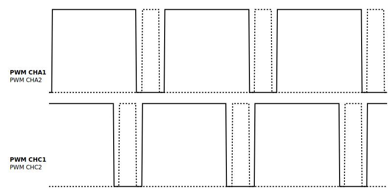

### Single/Dual Output

=== "Single Output"
    { width=800 }

    ```c++
        spin.pwm.startSingleOutput(PWMA, TIMING_OUTPUT1);    
    ```

=== "Single Output PWMx2"
    { width=800 }

    ```c++
        spin.pwm.startSingleOutput(PWMA, TIMING_OUTPUT2);    
    ```

=== "Dual Output"
    { width=800 }

    ```c++
        spin.pwm.startDualOutput(PWMA);
    ```

### Duty Cycle

=== "20% Duty cycle"
    { width=800 }

    ```c++
        spin.pwm.setDutyCycle(PWMA, 0.2);

    ```


=== "80% Duty cycle"
    { width=800 }

    ```c++
        spin.pwm.setDutyCycle(PWMA, 0.8);
    ```

=== "How it works"
    ){ width=800 }

    ```c++
        spin.pwm.setDutyCycle(PWMA, 0.8);
    ```

### Phase Shift

=== "20% Phase Shift"
    { width=800 }

    ```c++
        spin.pwm.setPhaseShift(PWMA,  72);
    ```

=== "80% Phase Shift"
    ){ width=800 }

    ```c++
        spin.pwm.setPhaseShift(PWMA,  288);
    ```

=== "How it works"
    { width=800 }

    ```c++
        spin.pwm.setPhaseShift(PWMA,  288);
    ```

### Dead Time

=== "2% Dead Time"
    { width=800 }

    ```c++
        spin.pwm.setDeadtime(PWMA,  100,  100);

    ```

=== "8% Dead Time"
    { width=800 }

    ```c++
        spin.pwm.setDeadtime(PWMA,  400,  400);
    ```

=== "Asymetric Dead Time leading edge"
    { width=800 }

    ```c++
        spin.pwm.setDeadtime(PWMA,  100,  400);
    ```

=== "Asymetric Dead Time trailing edge"
    { width=800 }

    ```c++
        spin.pwm.setDeadtime(PWMA,  400,  100);
    ```

### Modulation Type

=== "Left Aligned"
    { width=800 }

    ```c++
        spin.pwm.setModulation(PWMA, Lft_aligned);
        spin.pwm.setDutyCycle(PWMA, 0.28);
    ```

=== "Center Aligned"
    { width=800 }

    ```c++
        spin.pwm.setModulation(PWMA, UpDwn);
        spin.pwm.setDutyCycle(PWMA, 0.28);
    ```

### Multiple PWM