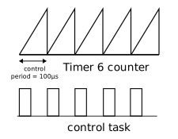

!!! note ""
    PowerAPI is meant to deploy easily Real-time programs that must guarantee response within specified time constraints.
    In that context, scheduling is the action of asigning computing ressources to perform tasks.

## Include

!!! note
    ```
    #include <TaskAPI.h>
    ```
    Make sure that Task API is included

## Deploying a real time control task

Having a periodical code execution is key to real time applications. It is easy to spawn one using the TaskAPI.


### The control task sources

 You can have different **source** calling the control task.

The control task is synchronous, it means that it is called at fixed period. So we need some kind of timer calling the control, this timer is considered as the **source**. There are two sources :   
- The PWM carrier  
- An independant timer   

#### The PWM carrier

The carrier has a period called the **switching period**, we can use it to call the control task after a fixed number of switching period. 


On the figure above, the switching period is 5µs (200Khz) and we call the control every 10 switching cycle so 50µs (20Khz).

!!! warning
    There are limitations when using this method :   
        - You need to start the a PWM to start the control task  
        - You can only have control period which are multiple of the switching period  
        - You can not have a control period inferior to the switching period  

!!! tip
    Synchronizing the control task period with PWM period can be usefull when you try to synchronize PWM between several SPIN or TWIST, in that case the control task is also synchronized between the board.  

#### Independant timer

A simple timer not related to the PWM can be used to compute the control task period. We choose one of the MCU timer (the `timer 6`), to which we give our control period and this timer will call the control task each period.  



!!! tip
    With an independant timer you can choose any value in µs as the control period, there is not the same limitation as the PWM source.  

!!! warning
    The disavantage of such method is that since it is independant from the PWM you can't have synchronization between several control task modules.

### Initialization sequence

!!! note
    1\. Create the critical task and link it to the function to be called.  
    2\. Start the critical function.  

!!! example
    === "20kHz Periodic task based on PWM"
        ```
            task.createCritical(my_critical_function, 50, HRTIM);
            task.startCritical();
        ```
    === "10kHz Periodic task based on Timer6"
        ```
            task.createCritical(my_critical_function, 100, TIM6);
            task.startCritical();
        ```

!!! tip
    Having a control Task is required for [synchronous measurements](adc/#synchronous-with-pwms) to work correctly.

## Non time critical tasks

In the powerAPI, non time critical tasks are refered as background tasks.

### Priority between critical and non-critical task

The control task has priority over any other task. It will preempts any background task. The control task can not be preempted. That is why it is also refered as an uninteruptible task.


### Initialization sequence

!!! note
    1\. Create the background task and link it to the function to be called.  
    2\. Start the background function.  

!!! example
    === "Spawning a background task"
        ```
            void my_background_function(){
                do_stuff();
            }
            spin.taskAPI.createBackground(my_background_function);
        ```
        In that case `do_stuff()` will execute continuously each time the processor is not occupied by the critical task.

    === "Making it pseudo periodic"
        ```
            void my_background_function(){
                do_stuff();
                suspendBackgroundUs(500);
            }
        ```
        In that case after executing `do_stuff();` the task will be suspended for 500us and resumed after. It creates a pseudo periodical task, runs every 500us + the time taken to execute `do_stuff()`.


::: doxy.powerAPI.class
name: TaskAPI
