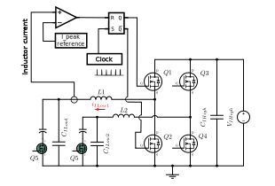

!!! Note ""
    This API is designed to work with Spin shields hardware, providing a set of functions to manage and control the shields.

To work with Spin API, include the following file in your code:
!!! note
    ```
    #include <ShieldAPI.h>
    ```

## Features

=== " "
    { width=200 align=left }
    - **Versatile Control Modes**: The API supports both voltage and peak current control modes, allowing you to choose the best option for your specific application.
    - **Independent Leg Operation**: Each of the two legs can operate independently with different topologies, such as boost or buck, offering greater flexibility in power management.
    - **Configure different paramaters** for power electronics (dead time, phase shift)
    - **Simplified ADC value retrieval**
    - Refer to [TWIST hardware specifications](https://github.com/owntech-foundation/TWIST) for more detail on TWIST board.

## Initialization sequence

!!! note
    === "Voltage mode with all the legs"

        1\. Choose the wished topology : buck, boost. You can select all the legs to be in the same topology or choose a specific configuration for each one [`shield.power.initBuck(ALL)`](https://owntech-foundation.github.io/Documentation/powerAPI/classPowerAPI/#function-initbuck), [`shield.power.initBoost(ALL)`](https://owntech-foundation.github.io/Documentation/powerAPI/classPowerAPI/#function-initboost)

        <details><summary>Optional steps</summary>
        2\. Set the adc decimation to divide the number of trigger event starting the adc conversion [`shield.power.setAdcDecim(ALL, decim)`](https://owntech-foundation.github.io/Documentation/powerAPI/classPowerAPI/#function-setadcdecim)
        3\. Set the dead time [`shield.power.setDeadTime(ALL, rise_deadTime_ns, fall_deadTime_ns)`](https://owntech-foundation.github.io/Documentation/powerAPI/classPowerAPI/#function-setdeadtime)
        4\. Set the phase shift in degree [`shield.power.setPhaseShift(ALL, ps_degree)`](https://owntech-foundation.github.io/Documentation/powerAPI/classPowerAPI/#function-setphaseshift)
        </details>

        5\. Enable the ADC acquisition for twist to get voltage and current measures [`shield.sensors.enableDefaultTwistSensors()`](https://owntech-foundation.github.io/Documentation/core/docs/shieldAPI/#function-enabledefaulttwistsensors)
        6\. Set the duty cycle to control output voltage [`shield.power.setDutyCycle(ALL, duty_cycle)`](https://owntech-foundation.github.io/Documentation/powerAPI/classPowerAPI/#function-setdutycycle)
        7\. Then start the converters [`shield.power.start(ALL)`](https://owntech-foundation.github.io/Documentation/powerAPI/classPowerAPI/#function-start)

    === "Voltage mode with only LEG1"

        1\. Choose the wished topology : buck, boost [`shield.power.initBuck(LEG1/LEG2)`](https://owntech-foundation.github.io/Documentation/powerAPI/classPowerAPI/#function-initbuck), [`shield.power.initBoost(LEG1/LEG2)`](https://owntech-foundation.github.io/Documentation/powerAPI/classPowerAPI/#function-initboost)

        <details><summary>Optional steps</summary>
        2\. Set the adc decimation to divide the number of trigger event starting the adc conversion [`shield.power.setAdcDecim(LEG1/LEG2, decim)`](https://owntech-foundation.github.io/Documentation/powerAPI/classPowerAPI/#function-setadcdecim)
        3\. Set the dead time [`shield.power.setDeadTime(LEG1/LEG2, rise_deadTime_ns, fall_deadTime_ns)`](https://owntech-foundation.github.io/Documentation/powerAPI/classPowerAPI/#function-setdeadtime)
        4\. Set the phase shift in degree [`shield.power.setPhaseShift(LEG1/LEG2, ps_degree)`](https://owntech-foundation.github.io/Documentation/powerAPI/classPowerAPI/#function-setphaseshift)
        </details>

        5\. Enable the ADC acquisition for twist to get voltage and current measures [`shield.sensors.enableDefaultTwistSensors()`](https://owntech-foundation.github.io/Documentation/core/docs/shieldAPI/#function-enabledefaulttwistsensors)
        6\. Set the duty cycle to control output voltage [`shield.power.setDutyCycle(LEG1/LEG2, duty_cycle)`](https://owntech-foundation.github.io/Documentation/powerAPI/classPowerAPI/#function-setdutycycle)
        7\. Then start the converters [`shield.power.start(ALL)`](https://owntech-foundation.github.io/Documentation/powerAPI/classPowerAPI/#function-start)

    === "Current mode with all the legs"

        1\. Choose the wished topology : buck, boost. You can select all the legs to be in the same topology or choose a specific configuration for each one [`shield.power.initBuck(ALL, CURRENT_MODE)`](https://owntech-foundation.github.io/Documentation/powerAPI/classPowerAPI/#function-initbuck), [`shield.power.initBoost(ALL)`](https://owntech-foundation.github.io/Documentation/powerAPI/classPowerAPI/#function-initboost)

        <details><summary>Optional steps</summary>
        2\. Set the adc decimation to divide the number of trigger event starting the adc conversion [`shield.power.setAdcDecim(ALL, decim)`](https://owntech-foundation.github.io/Documentation/powerAPI/classPowerAPI/#function-setadcdecim)
        3\. Set the dead time [`shield.power.setDeadTime(ALL, rise_deadTime_ns, fall_deadTime_ns)`](https://owntech-foundation.github.io/Documentation/powerAPI/classPowerAPI/#function-setdeadtime)
        4\. Set the phase shift in degree [`shield.power.setPhaseShift(ALL, ps_degree)`](https://owntech-foundation.github.io/Documentation/powerAPI/classPowerAPI/#function-setphaseshift)
        </details>

        5\. Enable the ADC acquisition for twist to get voltage and current measures [`shield.sensors.enableDefaultTwistSensors()`](https://owntech-foundation.github.io/Documentation/core/docs/shieldAPI/#function-enabledefaulttwistsensors)
        6\. Set the slope compensation to control the output current[`shield.power.setSlopeCompensation(ALL, 1.4, 1.0)`](https://owntech-foundation.github.io/Documentation/powerAPI/classPowerAPI/#function-setslopecompensation)
        7\. Then start the converters [`shield.power.start(ALL)`](https://owntech-foundation.github.io/Documentation/powerAPI/classPowerAPI/#function-start)


!!! warning
    Only buck topology is currently supported for current mode control.

!!! example

    === "Voltage mode with all the legs"

        ```cpp
        shield.power.initBuck(ALL);
        shield.power.setAdcDecim(ALL, 1);
        shield.power.setDeadTime(ALL, 200, 200);
        shield.power.setPhaseShift(ALL, 180);
        shield.sensors.enableDefaultTwistSensors();
        shield.power.setDutyCycle(ALL, 0.5);
        shield.power.start(ALL);
        ```
    === "Voltage mode with only LEG1"

        ```cpp
        shield.power.initBuck(LEG1);
        shield.power.setAdcDecim(LEG1, 1);
        shield.power.setDeadTime(LEG1, 200,200);
        shield.power.setPhaseShift(LEG1, 180);
        shield.sensors.enableDefaultTwistSensors();
        shield.power.setDutyCycle(LEG1, 0.5);
        shield.power.start(LEG1);
        ```

    === "Current mode with all the legs"

        ```cpp
        shield.power.initBuck(ALL, CURRENT_MODE);
        shield.power.setAdcDecim(ALL, 1);
        shield.power.setDeadTime(ALL, 200, 200);
        shield.power.setPhaseShift(ALL, 180);
        shield.sensors.enableDefaultTwistSensors();
        shield.power.setSlopeCompensation(ALL, 1.4, 1.0);
        shield.power.start(ALL);
        ```

## Voltage mode and Current mode

There is two different way to control the power delivered by TWIST : voltage and current mode.

### Voltage mode

Voltage mode is a traditional and widely-used approach in power electronics, where the output voltage is regulated by controlling the duty cycle. The duty cycle is a crucial parameter that determines the proportion of time a switch (such as a transistor) is active during a complete switching period. By adjusting the duty cycle, you can effectively manage the power delivered to a load.

A higher duty cycle indicates that the switch remains on for a more extended period, resulting in increased power delivery to the load. Conversely, a lower duty cycle means the switch is on for a shorter duration, thereby reducing the power supplied. Consequently, the average power and voltage applied to the load can be precisely controlled by fine-tuning the duty cycle.

=== " Voltage mode PWM schematic "
    

=== " Voltage mode PWM waveform "
    

### Current mode

In peak current mode control,  we monitors the current flowing through the power switch. Once the current reaches a predetermined peak value, we promptly turns off the power switch. This mechanism helps maintain a constant output voltage by regulating the current flow.

 In this setup, a clock signal determines the switching frequency and triggers the switch to close. The controller then sends a reference peak current value. When the inductor's current reaches this reference value, the switch opens.

=== " Current mode schematic "
    { width=600 }

=== " Current mode waveform "
    { width=600 }

However, using a constant peak current reference can lead to subharmonic oscillations. To prevent this issue, we employ a technique called slope compensation. Instead of a constant value, the peak current reference is a sawtooth waveform. The final schematic with slope compensation is shown below:


=== " Final current mode schematic "
    { width=600 }

=== "Final current mode waveform "
    

The sawtooth signal `Slope compensation` is generated with the function [`shield.power.setSlopeCompensation`](https://owntech-foundation.github.io/Documentation/powerAPI/classPowerAPI/#function-setslopecompensation). This function sets the slope compensation based on the input parameters.  for example `shield.power.setSlopeCompensation(ALL, 1.4, 1.0)` generates a sawtooth signal ranging from 1.4V to 1.0V. You can create a sawtooth signal between 2.048V and 0V as well.

This sawtooth signal is then compared with the ADC's current value. When selecting the sawtooth parameters, it's essential to consider the conversion of current to voltage.

On the TWIST board, a voltage value of 1.024V on the ADC corresponds to a current of 0A. The system has a gain of 100mV per ampere, meaning that for each ampere increase in current, the voltage value increases by 100 millivolts.


## Snippets examples

### Buck topology

#### 2 legs with the same configuration

=== " Connection "
    { width=400 }

=== " Schematic "
    

```cpp
    shield.power.initBuck(ALL);
    shield.power.setDutyCycle(ALL, 0.5);
    shield.power.start(ALL);
```

#### 2 independant leg operations


=== " Connection "
    { width=400 }

=== " Schematic "
    

```cpp
    shield.power.initBuck(LEG1);
    shield.power.initBuck(LEG2);
    shield.power.setDutyCycle(LEG1, 0.3);
    shield.power.setDutyCycle(LEG2, 0.5);
    shield.power.start(ALL);
```

### Boost topology

=== " Connection "
    { width=400 }

=== " Schematic "
    

```cpp
    shield.power.initBoost(ALL);
    shield.power.setDutyCycle(ALL, 0.5);
    shield.power.start(ALL);
```

### Inverter topology

=== " Connection "
    { width=400 }

=== " Schematic "
    

```cpp
    shield.power.initBuck(LEG1);
    shield.power.initBoost(LEG2);
    shield.power.setDutyCycle(ALL, 0.5);
    shield.power.start(ALL);
```
!!! example

    Check the following examples for an application :
        - [Voltage mode buck](https://owntech-foundation.github.io/Documentation/examples/TWIST/DC_DC/buck_voltage_mode/)
        - [Current mode buck](https://owntech-foundation.github.io/Documentation/examples/TWIST/DC_DC/buck_current_mode/)
        - [Voltage mode boost](https://owntech-foundation.github.io/Documentation/examples/TWIST/DC_DC/boost_voltage_mode/)

## Detailed documentation on available APIs classes:
- [Power API](https://owntech-foundation.github.io/Documentation/powerAPI/classPowerAPI)
- [Sensors API](shield_sensors.md)

## Detailed documentation on Hardware Abstraction Layer classes:
- [NGND HAL](https://owntech-foundation.github.io/Documentation/powerAPI/classNgndHAL)

## API Reference
::: doxy.powerAPI.class
name: ShieldAPI
