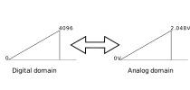

!!! note ""
    A Digital-to-Analog Converter (DAC) transforms digital signals into analog signals by mapping digital values to specific voltages. This process effectively creates continuous analog waveforms from discrete digital data. DACs play a vital role in electronic systems by enabling the generation of diverse waveforms.

## Initialization sequence

!!! note
    1\. First start by calling the initialization function of the DAC [`spin.dac.initConsValue(DAC_NUM)`](https://owntech-foundation.github.io/Documentation/core/docs/dac/#function-initconstvalue).   
    2\. Second enter the integer value to send to the DAC [`spin.dac.setConstValue(DAC_NUM, DAC_CHAN, DAC_VALUE)`](https://owntech-foundation.github.io/Documentation/core/docs/dac/#function-setconstvalue)  

!!! example
    ```cpp
    spin.dac.initConstValue(2); // DAC 2 initialization
    spin.dac.setConstValue(2, 1, 2048);
    ```

## Conversion from numerical to analog value

The value we can send to the DAC is an integer between 0 and 4096, this value is then converted to voltage between 0 and 2.048V.
For example : 

```cpp
spin.dac.setConstValue(2, 1, 2048);
```
Generate a 1.024V signal.



!!! example
    For a practical example of the DAC see the example :
        - [Signal generation](https://owntech-foundation.github.io/Documentation/examples/SPIN/DAC/signal_generation/)

## API Reference

::: doxy.powerAPI.class
name: DacHAL
