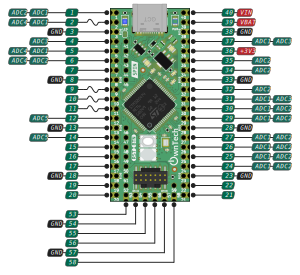
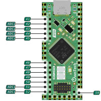
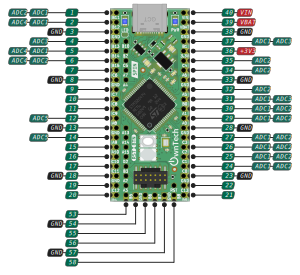
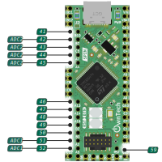

!!! note ""
    Data acquisition is the process of sampling signals that measure real-world physical conditions and converting the resulting samples into digital numeric values that can be manipulated by a computer.

    In the PowerAPI context, the DataAPI helps the user to easily configure the ADC and retrieve the acquired values.

    The Data API configures the DMAs to store the ADCs acquisitions for the Spin board, and dispatches them in per-channel buffers that can be read by the user. The module also provides functions to convert the raw values acquired by the sensors into values in the adequate unit.

    If using a shield such as Twist, a dedicated interface for sensors configuration is made available by the [Shield sensors API](shield_sensors.md).

## Quick start with Spin Data API

Note that if you use a shield on the Spin board, you can use the functions provided by the shield API : ``shield.sensors``, which provides the an API similar as this one, but with also more specialized functions that take into consideration shield specificities: sensors accessible by name rather than by using the pin number, initial conversions factors for raw values adapted depending on the sensors, etc.

The Data API is for use only if you do not use a shield, or want to access to a pin that is not connected to a sensor of the shield.

### Include

Data API is part of Spin API: it is made available by including the `SpinAPI.h` header. From there, a `spin.data` object is available to interact with the API.
!!! note
    ```
    #include <SpinAPI.h>
    ```

### Setup phase

To use Data API, the first stage is to indicate on which pin of the Spin board you want to acquire data. Not all pins can be used for that purpose: the pin must be linked to an ADC. Here is the list of pins that provide ADC capabilities:

=== "SPIN v1.1.0"
    { width=451 align=left }
    { width=243 }

=== "SPIN v1.0.0"
    { width=451 align=left }
    { width=243 }

To indicate that the value of a pin should be acquired, the acquisition must be enabled on this pin in the setup phase. This can be done using the `enableAcquisition()` function:

!!! note
    ```
    // Pins connected to a single ADC:
    spin.data.enableAcquisition(35); // Enable acquisition on pin 35 (will use ADC 2)
    spin.data.enableAcquisition(12); // Enable acquisition on pin 12 (will use ADC 5)
    // Pins connected to multiple ADCs:
    spin.data.enableAcquisition(5, ADC_4); // Acquisition on pin 5 using ADC 4
    spin.data.enableAcquisition(31); // Acquisition on pin 31 (will use ADC 1 by default)
    ```

Note that providing the ADC number is not required. For pins connected to multiples ADC, the ADC with the lowest number will be used if no ADC is specified. Specifying an ADC number that is not available on the pin will result in an error.

By default, the acquisitions are software-triggered, which means that when your program will want to acquire a measure, you'll have to trigger the acquisition. Other means of triggering the measure exists, notably periodic acquisitions, see [detailed information](adc.md#synchronous-with-pwms). If you need to change the trigger source, this must be done at this point.

At the end of all the hardware configuration (including other modules), the Data API must be started using the `start()` function. Note that in case you use an [uninterruptible task](task_introduction.md), you do not need to start the Data API manually, this will be done automatically when the uninterruptible task is started.

### Obtaining data

After the Data API has been started, it becomes possible to get data obtained from the enabled pins. Depending on the trigger source, you'll have to trigger the acquisition then read the value, or directly read the value.

If software-trigged is used for an ADC (default configuration), the acquisition must first be triggered, then the value read. If the acquisition is configured to be periodic for ann ADC, directly read the value.

!!! note
    === "Sofware-triggered acquisition"
        ```
        spin.data.triggerAcquisition(ADC_2); // Trigger acquisitions of all pins linked to ADC 2
        spin.data.getLatestValue(35); // Get value read on pin 35
        ```

    === "Periodic acquisition"
        ```
        spin.data.getLatestValue(35); // Get value read on pin 35
        ```

## Advanced usage

The above procedure is only for basic usage. Data API has other capabilities that can be configured.

### Controlling the conversion

By default, the raw acquired values are provided, except if the board was calibrated.

!!! abstract "Raw ADC values"
    -  ADC resolution is 12 bit: the value ranges from 0 to 4096
    -  Sensing full scale: 0 V to 2.048 V
    -  The returned value is then linear, from 0 for 0 V to 4096 for 2.048 V

You can edit the conversion factors by calling one of the ``spin.data.setConversionParameters***()`` functions.
E.g. ``setConversionParametersLinear(35, 2, -0.1);`` will set the conversion parameters for pin 35 to ``Linear``, with a gain of ``2`` and an offset of ``-0.1``.

### Obtaining all the acquired data

When using ``getLatestValue()``, only the latest acquired value for the pin is returned, already converted using conversion parameters set for the pin (if any has been configured).

If you need more precision, you can get all values acquired on a pin since the previous call to a ``get`` function.
To do so, use ``getRawValues()``, to obtain all values without any conversion or ``getValues()`` to obtain values after conversion.
Warning: using the ``getValues()`` function will convert values on-the-fly. This can be long depending on the number of values to be converted and the type of conversion.

These function act similarly, except for the conversion part: they are called with two parameters, the first one is an input parameter indicating which pin you want data from, and the second is an output parameter, a uint32_t whose value will be updated by the function to indicate how many values are available. The function returns an array that has to be stored in a pointer variable.

!!! note
    === "Using the converted values"
        ```
        // Declare a variable for the output parameter:
        uint32_t valuesCount;
        // Get the values: array of float32_t for converted values
        float32_t* array = spin.data.getValues(35, valuesCount);

        // Access the values:
        for (int i = 0 ; i < valuesCount ; i++)
        {
            // Do something with array[i]
        }
        ```

    === "Using the raw values"
        ```
        // Declare a variable for the output parameter:
        uint32_t valuesCount;
        // Get the values: array of float32_t for converted values
        uint16_t* array = spin.data.getRawValues(35, valuesCount);

        // Access the values:
        for (int i = 0 ; i < valuesCount ; i++)
        {
            // Do something with array[i]
            // E.g. you can use the conversion function
            float32_t convertedValue = spin.data.convertValue(35, array[i]);
        }
        ```

### Channel sequence

Each ADC unit can measure multiple analog signal. This works by defining an acquisition sequence.

!!! tip
    By default the aquisition sequence is in continuous mode. It means than one trigger will trigger all the sequence of acquisition.
    This can be changed using [Discontinuous Mode](#continuous-discontinuous-sequence)

!!! example
    === "3 channels on ADC1"
    ```c++
    spin.adc.enableAcquisition(2, ADC_1)
    spin.adc.enableAcquisition(3, ADC_1)
    spin.adc.enableAcquisition(1, ADC_1)
    ```
    In this example, for each trigger action, the ADC1 will measure channel 2, then channel 3, then channel 1.

    === "Single channel"
    ```spin.adc.enableChannel(1, ADC_1)```

    In this example, for each trigger, the ADC1 will measure channel 1.

!!! note
    The sequence order is given by the order in which the `spin.adc.enableChannel()` function is called.
    E.g., in the above case, the acquisition order would be pin 2, then 3, then 1.


### The different event and trigger of ADC/HRTIM

You might have seen that there are differents variables referencing adc trigger :

```cpp
spin.data.configureTriggerSource(ADC_1, hrtim_eev1);
spin.pwm.setAdcTrigger(PWMA, ADCTRIG_1);
```
There is `hrtim_eevx` or `ADCTRIG_x`, let's see the role of each of them.

#### ADCTRIG_x

In the PWM API, four signals can serve as ADC triggers, initiating ADC conversions: ADC_TRIG1, ADC_TRIG2, ADC_TRIG3, and ADC_TRIG4.

The PWM is produced by a carrier (see [here](spin_pwm.md)) by using a comparator to compare a specific constant value with the carrier, we can generate an event when enabling a trigger on the PWM. For instance :

```c++
spin.pwm.setAdcTrigger(PWMA, ADCTRIG_1);
spin.pwm.enableAdcTrigger(PWMA);
```

We are enabling and linking ADCTRIG_1 to PWMA. That means that when the comparator value and the carrier value of the PWMA we can generate an event from ADCTRIG_1 that can be used to start an ADC conversion :


The comparator value can be adjusted using the function `spin.pwm.setAdcTriggerInstant(PWMA, 0.5)`. For example, setting it to 0.5 means triggering an event halfway through the switching period, initiating an ADC conversion.

#### hrtim_eevx

An acquisition can be initiated either by software (via a function) or hardware through an external event. Numerous external events exist, but some are specifically related to PWM: `hrtim_eev1`, `hrtim_eev2`, `hrtim_eev3`, and `hrtim_eev4`.

Each of these external events is associated with events generated by ADCTRIG_x. For instance, hrtim_eev1 is linked to ADCTRIG_1, and so on.

```cpp
spin.pwm.setAdcTrigger(PWMA, ADCTRIG_1);
spin.pwm.enableAdcTrigger(PWMA);
spin.data.configureTriggerSource(ADC_1, hrtim_eev1);
```
The above code indicates that we've connected ADC**1** to the external event **hrtim_eev1**, which, in turn, is connected to the event generated by **ADCTRIG1** when the comparator (set by the trigger value) matches the carrier of **PWMA**.

### Continuous / Discontinuous sequence

!!! note
    This is relevant if more than one measurement is taken with the same ADC.

=== "Continuous sequence"
    { width=800 }
    All enabled pins for the ADC are acquired at each trigger

    ```c++
        spin.data.configureDiscontinuousMode(ADC_1, 0);
    ```

=== "Discontinuous sequence "
    { width=800 }
    Only acquire one pin in the sequence at each trigger. The next trigger will acquire the next pin in the sequence, etc.

    ```c++
        spin.data.configureDiscontinuousMode(ADC_1, 1);
    ```


## Deeper understanding of Data API

### Data dispatching

When using the control task (critical task) data are dispatched at the start, which means there are ready to be retrieved by the ``get***()`` functions.


Data dispatching is an internal mechanism of Data API, that transfers Data from the internal buffers controlled by the DMA to user-level buffers that can be retreived by the ``get***()`` functions. If dispatching is not done, the user will not be able to retrive values, and the ``get***()`` functions will return no value.

The dispatch is done automatically and the in most cases, the user does not have to worry about it. However, in some cases, the user may want to know when this is done.

If you use an [uninterruptible task](task_introduction.md) to manage the converter on a fast loop, the dispatch is automatically done just before each call of the task.

If you do not have an uninterruptible task however, then the dispatch will be done once all enabled acquisitions for an ADC have been done.
This means that if you configure ADC 1 with one acquisition and ADC 3 with two acquisitions, the data for a pin controlled by the ADC 1 will be available at each acquisition, while the data for a pin controlled by the ADC 3 will only be available every time it has acquired two values.

### API start

The Data API must be started after all configuration has been carried out. However, in most common cases, this will happen automatically.
If you use an [uninterruptible task](task_introduction.md) to manage the converter on a fast loop, the Data API is automatically started when the task is started.

The cases where you have to manually start the Data API are the following:
* No uninterruptible task defined in the program,
* An uninterruptible task is defined, but its start function is called with a value ``false`` for its parameter.

The second case is only used in advanced scenarios where the user want full control over Data API.

If you use Data API in one of these cases, the Data API must be started using the `start()` function. This call must only be made at the end of all the hardware configuration (including other modules).

## Initialization sequence

If you want specific ADC behavior (trigger sources, discontinuous mode, etc.), you may want to configure the ADCs using the lower-level [ADC API](adc.md) first. Then, you can enable channels that you want to acquire.

After channels have been enabled, the conversion parameters can be set so that raw values can be automatically converted to the relevant unit. This is done using the `spin.data.setParameters()` function.

After channels have been enabled (and optionnally conversion parameters have been set), there are two ways of starting the API, depending on your use of other OwnTech APIs. If your code uses an [uninterruptible task](task_introduction.md), nothing more is required, the Data API will be started automatically when task is started. However, if you do not have an uninterruptible task in your code, you need to manually start the API by calling `spin.data.start()`.

!!! Note

    === "Software triggered"
        1. Enable acquisition on the pins you want: [`spin.data.enableAcquisition()`](#function-enableacquisition)
        2. Define acquisition conversion parameters, e.g. using [`spin.data.setConversionParametersLinear()`](#function-setconversionparameterslinear)
        3. Start data dispatching [`spin.data.start()`](#function-start)
        4. Trigger an initial adc conversion [`spin.data.triggerAcquisition(ADCx)`](#function-triggeracquisition)
        5. Retrieve values : [`spin.data.getLatestValue()`](#function-getlatestvalue) or [`spin.data.getRawValues()`](#function-getrawvalues)

    === "Hardware triggered"
        1. [Make sure PWM engine is initialized](spin_pwm.md)
        2. Enable acquisition on the pins you want: [`spin.data.enableAcquisition()`](#function-enableacquisition)
        3. Define acquisition conversion parameters, e.g. using [`spin.data.setConversionParametersLinear()`](#function-setconversionparameterslinear)
        4. Start data dispatching [`spin.data.start()`](#function-start)
        5. Retrieve values : [`spin.data.getLatestValue()`](#function-getlatestvalue) or [`spin.data.getRawValues()`](#function-getrawvalues)

!!! example

    === "Software triggered ADC"
        ```cpp
        spin.data.enableAcquisition(5, ADC_1); // Enable acquisition on pin 5 using ADC 1
        spin.data.start();
        spin.data.triggerAcquisition(ADC_1); // Trigger acquisition for ADC 1
        float32_t adc_value = spin.data.getLatestValue(5); // Get latest value acquired for pin 5
        ```
    === "Hardware triggered ADC"
        ```cpp
        /* PWM unit initialization */
        spin.pwm.setModulation(PWMA, UpDwn);
        spin.pwm.setAdcEdgeTrigger(PWMA, EdgeTrigger_up);
        spin.pwm.setAdcDecimation(PWMA, 1);
        spin.pwm.setMode(PWMA, VOLTAGE_MODE);
        spin.pwm.initUnit(PWMA);
        spin.pwm.setDeadTime(PWMA, 200,200);
        spin.pwm.setAdcTrigger(PWMA, ADCTRIG_1);
        spin.pwm.enableAdcTrigger(PWMA);
        spin.pwm.setDutyCycle(0.5);
        spin.pwm.startDualOutput(PWMA);

        /* ADC initialization */
        spin.data.configureTriggerSource(ADC_1, hrtim_eev1); // ADC 1 ; HRTIM event 1
        spin.data.configureDiscontinuousMode(ADC_1, 1); // ADC 1 ; acquire 1 pin at each event
        spin.data.enableAcquisition(5, ADC_1); // Pin 5 using ADC 1
        spin.data.start();
        float32_t adc_value = data.getLatestValue(5); // Pin 5
        ```

## Retrieving latest value

Getting the latest measured value to feed the control algorithm is super simple.

!!! example
    === "Get latest value"
        ```
        spin.data.getLatest(5)
        ```
        This will retrieve the latest sampled value of ADC 1 pin 5.

## Getting values with the right unit

DataAPI contains commodity functions to convert the raw binary measurement values in meaningful units.

!!! example
    === "Converting in volts"
        ```
        spin.data.setParameters()
        ```

## Get an array of values

DataAPI contains commodity function to retrieve an array of raw values that can be fed to a [post processing filter](https://owntech-foundation.github.io/Documentation/controlLibrary/docs/use-filters).

!!! example
    === "Retrieve 5 values"
        ```
        spin.data.getRawValues()
        ```

::: doxy.powerAPI.class
name: DataAPI
