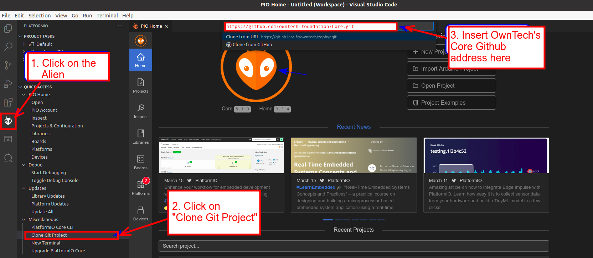

If you use or wish to use Visual Studio Code, follow this tutorial to set up your work environment.

Requirements
---------------

Before we start, make sure you meet all the requirements below.

!!! warning Required software
    **OS:** Windows, Mac or Linux
    **Git:** Make sure that you have Git installed on your machine.
    **Python3:** Make sure you have python3 installed in your machine.

    ??? tip Installing git
         You can follow one of these links to install git. [GitInstallation](https://git-scm.com/book/en/v2/Getting-Started-Installing-Git).
         **Windows:** Go directly to [GitForWindows](https://gitforwindows.org/)


Setup your VSCode work environment
---------------

To use OwnTech's system, we will use:

* **Visual Studio Code** - The platform or Integrated Development Environment we will use to write code.
* **PlatformIO** - A Visual Studio Code plugin that is a toolbox for microcontrollers

??? warning Required Memory Space
    Make sure that you have more than 2GB on your hard drive so that PlatformIO can download all the required files without issues.

Here is how to setup the work environment:

??? note Step 1 - Empty folder
    Create an empty folder in which you will work throughout the tutorials.
    :warning: Make sure that you have administrator privileges on the folder where you clone your repository.

??? note Step 2 - Intall VSCode
    Download Visual Studio Code, either from <https://code.visualstudio.com/> or from the repository manager of your OS. Visual Studio will suggest the version to install according to your OS.

??? note Step 3 - Install PlatformIO
    Launch Visual Studio Code. On the left side menu, click on the extension icon .
    In the search engine, type "PlatformIO IDE", and click install.
    Finally, restart Visual Studio Code when you are prompted to do so.

    


??? note Step 4 - Open PlatformIO in VSCode
    In Visual Studio code, on the left side menu, click on PlatformIO icon ! :material-information-outline:{ title="Pro tip" if the alien icon does not show up spontaneously, wait for a few more seconds, then press F1 key and type platformio home.}
**If you are on linux and PlatformIO do not find the python path, you can launch the following command :**
**'''sudo apt install python3-venv'''**

??? note Step 5 - Clone our Core
    In platformio, select "Clone Git Project ". PlatformIO will automatically open a field in which you can copy and paste the path below :
    ```
    https://github.com/owntech-foundation/Core
    ```
      PlatformIO will ask you in which folder to clone the project. Choose the folder you have created previously. A pop up will appear asking if you trust the authors. You can trust us. :smile:\
         :warning: Make sure that the name of the cloned project has no space in its path as it would create issues.

      


??? note Step 6 - Check your branch
      Make sure you are on the `main` branch of the Git project. You should see the following file tree.
      


??? note Step 7 - Build the code
      In the bottom menu, click on the Build icon . This will launch the compilation of the code. If this is the first time that you compile, Visual Studio Code will download several extensions that are required to write the code onto OwnTech’s microprocessor.

      When the compilation is completed, you should see:

      

If you have no more problems, go the blinky page.


!!! error Step 8 - Troubleshooting
    Here is where multiple errors may occur. From experience, the main issues that are really recurrent are:

      !!! warning On Windows:
        - Check that you are working on a path that is not liked to OneDrive
        - Check that you do not have any spaces in the path of your project
        - Check that the length of your project path is smaller than 256 characters. You should preferably have your project folder as close as possible to the root
        - Check that you have python 3 installed on your machine
        - Check that you have CMake installed on your machine
        - Check that you have git installed on your machine

      !!! warning On Linux:
        - Check that your Linux is 64bits


**Contributors**

- 2024.02.24: Ayoub Farah, Luiz Villa
- 2021.11.04: Loïc Quéval, Romain Delpoux, Adrien Prévost
- 2021.11.07: Luiz Villa, Antoine Boche
- 2022.01.24: Luiz Villa, Adrien Prevost, Loïc Quéval
- 2022.03.13: Luiz Villa
- 2022.05.06: Luiz Villa
- 2022.06.23: Loïc Quéval
- 2022.01.16: Mathilde Longuet and Luiz Villa
- 2023.07.10: Luiz Villa
- 2023.09.02: Mathilde Longuet
- 2023.09.25: Mathilde Longuet
