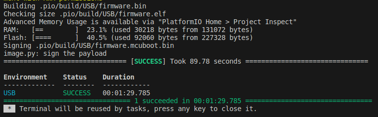

If you use or wish to use Visual Studio Code, follow this tutorial to set up your work environment.

## Requirements

Before we start, make sure your machine meets all the requirements below.

!!! tips "Required software"
    === "Windows"
        - **Git:** If you do not have git installed, get it here [git for Windows](https://gitforwindows.org)
        - **Python3:** If you do not have python3 installed, get it here [Python3 Installers](https://www.python.org/downloads/windows)
        - **CMake:** If you do not have CMake installed, get it here [CMake Installer](https://cmake.org/download/)

    === "macOS"

        - **Git:** If you do not have git installed, get it here [git for macOS](https://git-scm.com/download/mac)
        - **Python3:** If you do not have python3 installed, get it here [Python3 Installers](https://www.python.org/downloads/macos/)
        - **CMake:** If you do not have CMake installed, get it here [CMake Installer](https://cmake.org/download/)

    === "Linux"

        - **Git:** If you do not have git installed, get it here [git for Linux](https://git-scm.com/download/linux)
        - **Python3:** If you do not have python3 installed, get it here [Python3 Installers](https://docs.python-guide.org/starting/install3/linux/)
        - **CMake:** If you do not have CMake installed, get it here [CMake Installer](https://cmake.org/download/)
        - 64 bit linux installation


## Setup your VSCode work environment

To use OwnTech's system, we will use:

* **Visual Studio Code** - The platform or Integrated Development Environment we will use to write code.
* **PlatformIO** - A Visual Studio Code plugin that is a toolbox for microcontrollers

!!! info "Required Memory Space"
    Make sure that you have more than 2GB on your hard drive so that PlatformIO can download all the required files without issues.

Here is how to setup the work environment:

### Step 1 - Empty folder

Create an empty folder in which you will work throughout the tutorials.

!!! warning
    === "Windows"
        - Make sure that you have **administrator privileges** on the folder where you clone your repository.
        - Check that you are working on a **path that is not liked to OneDrive**
        - Check that you **do not have any spaces in the path** of your project
        - Check that the **length of your project** path is smaller than 256 characters.
        - You should preferably have your project folder as close as possible to the root


### Step 2 - Intall VSCode

[Download ](https://code.visualstudio.com/#alt-downloads) and install Visual Studio Code.

### Step 3 - Install PlatformIO

Launch Visual Studio Code.

On the left side menu, click on the extension icon !(1)
{ .annotate }

1. The icon looks like this: 

In the search engine, type "PlatformIO IDE", and click install.
Finally, restart Visual Studio Code when you are prompted to do so.


### Step 4 - Open PlatformIO in VSCode

In Visual Studio code, on the left side menu, click on PlatformIO icon ! (1)
{ .annotate }

1. The PlatformIO icon looks like this: 

!!! tip   "Pro tip"
    if the alien icon does not show up spontaneously, wait for a few more seconds, then press F1 key and type platformio home.

!!! info
    === "Linux"
        If you are on linux and PlatformIO do not find the python path, you can launch the following command :
        ```
        sudo apt install python3-venv
        ```

### Step 5 - Clone our Core
In platformio, select "Clone Git Project ".

latformIO will automatically open a field in which you can copy and paste the path below :

```
https://github.com/owntech-foundation/Core
```

PlatformIO will ask you in which folder to clone the project.

Choose the folder you have created previously. A pop up will appear asking if you trust the authors.

You can trust us. :smile:


### Step 6 - Check your branch


=== " "
     { align=left }

     Make sure you are on the `main` branch of the Git project.

     You can see it on the bottom left of the VSCode window as shown in the image to the left.

### Step 7 - Build the code

In the bottom menu, click on the Build icon. (1)
{ .annotate }

1. The build icon looks like this: .

This will launch the compilation of the code.

If this is the first time that you compile, Visual Studio Code will download several extensions that are required to write the code onto OwnTech’s microprocessor.

!!! note "Coffee Time"
    This step can take several minutes specially in older machines.
    Do not hesitate to go get yourself a coffee.

When the compilation is completed, you should see:



Congratulations! You are all set to run [your first example](first_example.md)!

In the unlikely event that you cannot compile, please refer to the troubleshooting section below.

### Step 8 - Troubleshooting

From our exeprience, there are multiple types of errors that block compilation.

Check the list below of possible issues

??? bug "List of known issues"

    === "Windows"
        - **Git:** If you do not have git installed, get it here [git for Windows](https://gitforwindows.org)
        - **Python3:** If you do not have python3 installed, get it here [Python3 Installers](https://www.python.org/downloads/windows)
        - **CMake:** If you do not have CMake installed, get it here [CMake Installer](https://cmake.org/download/)
        - Make sure that you have **administrator privileges** on the folder where you clone your repository.
        - Check that you are working on a **path that is not liked to OneDrive**
        - Check that you **do not have any spaces in the path** of your project
        - Check that the **length of your project** path is smaller than 256 characters.
        - You should preferably have your project folder as close as possible to the root

    === "macOS"
        - **Git:** If you do not have git installed, get it here [git for macOS](https://git-scm.com/download/mac)
        - **Python3:** If you do not have python3 installed, get it here [Python3 Installers](https://www.python.org/downloads/macos/)
        - **CMake:** If you do not have CMake installed, get it here [CMake Installer](https://cmake.org/download/)

    === "Linux"

         - **Git:** If you do not have git installed, get it here [git for Linux](https://git-scm.com/download/linux)
        - **Python3:** If you do not have python3 installed, get it here [Python3 Installers](https://docs.python-guide.org/starting/install3/linux/)
        - **CMake:** If you do not have CMake installed, get it here [CMake Installer](https://cmake.org/download/)
        - Check that your Linux is 64bits


??? success "List of contributors"
    Here is a short list of contributors to this page:

    - 2024.02.24: Ayoub Farah, Luiz Villa
    - 2021.11.04: Loïc Quéval, Romain Delpoux, Adrien Prévost
    - 2021.11.07: Luiz Villa, Antoine Boche
    - 2022.01.24: Luiz Villa, Adrien Prevost, Loïc Quéval
    - 2022.03.13: Luiz Villa
    - 2022.05.06: Luiz Villa
    - 2022.06.23: Loïc Quéval
    - 2022.01.16: Mathilde Longuet and Luiz Villa
    - 2023.07.10: Luiz Villa
    - 2023.09.02: Mathilde Longuet
    - 2023.09.25: Mathilde Longuet
