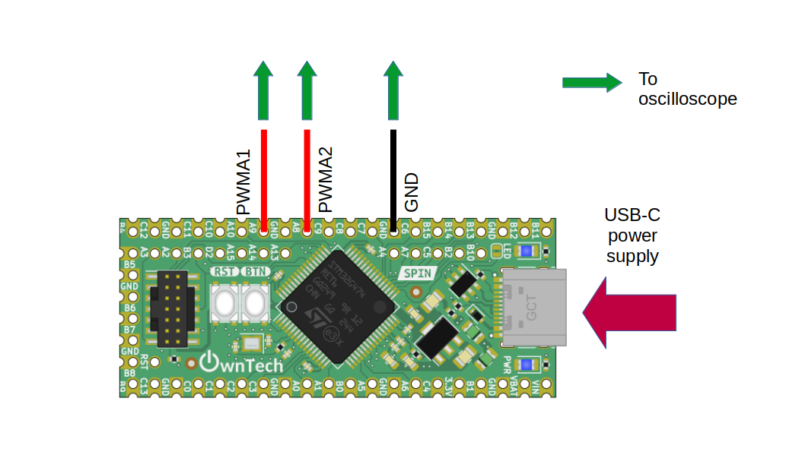
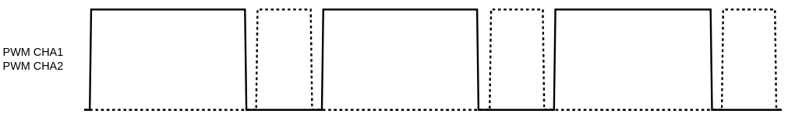

# Setting the duty cycle

In the context of Pulse Width Modulation (PWM), the duty cycle refers to the proportion of time that a signal is in the "on" state compared to the total period of the signal. It represents the percentage of time during which the signal is at its maximum level.

In power electronics, such as motor control, power supplies, and voltage regulation, PWM is a widely used technique for controlling the amount of power delivered to a load. The duty cycle of the PWM signal determines the average power delivered to the load. By adjusting the duty cycle, engineers can control the speed of motors, regulate voltage levels, and efficiently manage power consumption.

In this example we'll see how to generate a PWM, an control the duty cycle.

## Hardware setup and requirements

The spin can use up to 5 different PWM : PWMA, PWMC, PWMD, PWME and PWMF. This example will detail how to work with one of them : PWMA.


*Figure 1*

PWMA has two complementary channels :

- PWMA1 on gpio A8
- PWMA2 on gpio A9

You will need :

- A spin
- A usb-c cable to supply the spin
- An oscilloscope to watch PWM waveform

## Software setup

First we start by initializing the PWMA :

```cpp
    spin.pwm.setFrequency(200000); // Set frequency of pwm
    spin.pwm.initUnit(PWMA); // timer initialization
```

The frequency for the pwm is initalized to 200kHz but you are free to choose another value.

The duty cycle is updated in the high-speed control task :

```cpp
    spin.pwm.setDutyCycle(PWMA, duty_cycle);
```

You can control the duty cycle from the serial monitor :
- press `u` to increase the duty cycle
- press `d` to decrease the duty cycle

See [ownplot](https://github.com/owntech-foundation/OwnPlot) if you would like a better graphical interface for the serial monitor.

## Expected result



On the oscilloscope you should observe two complementary PWM and their evolution when you increase/decrease the duty cycle.